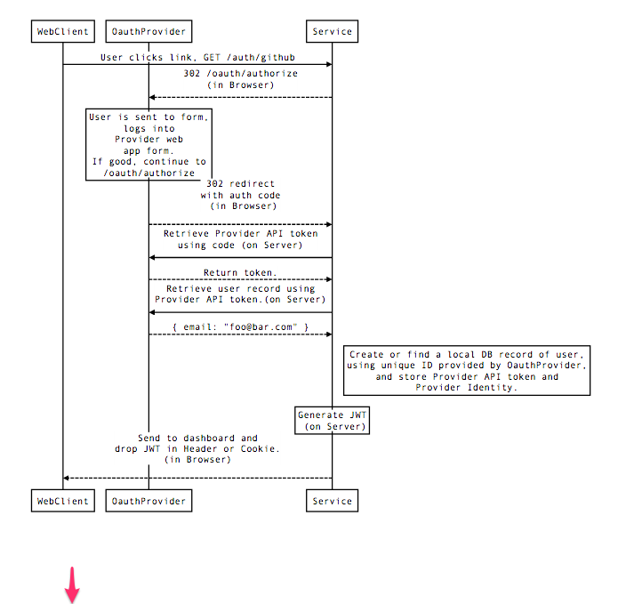

## Chronograf with OAuth 2.0 (Github-style)

OAuth 2.0 Style Authentication


### Configuration

To use authentication in Chronograf, both Github OAuth and JWT signature need to be configured.

#### Creating Github OAuth Application

To create a Github OAuth Application follow the [Register your app](https://developer.github.com/guides/basics-of-authentication/#registering-your-app) instructions.
Essentially, you'll register your application [here](https://github.com/settings/applications/new)

The `Homepage URL` should be Chronograf's full server name and port.  If you are running it locally for example, make it `http://localhost:8888`

The `Authorization callback URL` must be the location of the `Homepage URL` plus `/oauth/github/callback`.  For example, if `Homepage URL` was 
`http://localhost:8888` then the `Authorization callback URL` should be `http://localhost:8888/oauth/github/callback`.

Github will provide a `Client ID` and `Client Secret`.  To register these values with chronograf set the following environment variables:

* `GH_CLIENT_ID` 
* `GH_CLIENT_SECRET` 

For example:

```sh
export GH_CLIENT_ID=b339dd4fddd95abec9aa
export GH_CLIENT_SECRET=260041897d3252c146ece6b46ba39bc1e54416dc
```

#### Configuring JWT signature

Set a [JWT](https://tools.ietf.org/html/rfc7519) signature to a random string.
*Keep this random string around!* 

You'll need it each time you start a chronograf server because it is used to verify 
user authorization. If you are running multiple chronograf servers in an HA configuration set the `TOKEN_SECRET` on each to allow users to stay logged in.

```sh
export TOKEN_SECRET=supersupersecret
```

#### Optional Github Organizations

To require an organization membership for a user, set the `GH_ORGS` environment variables
```sh
export GH_ORGS=biffs-gang
```

If the user is not a member, then the user will not be allowed access.

To support multiple organizations use a comma delimted list like so:

```sh
export GH_ORGS=hill-valley-preservation-sociey,the-pinheads
```

### Design

The Chronograf authentication scheme is a standard [web application](https://developer.github.com/v3/oauth/#web-application-flow) OAuth flow.



The browser receives a cookie from Chronograf, authorizing it.  The contents of the cookie is a JWT whose "sub" claim is the user's primary
github email address.

On each request to Chronograf, the JWT contained in the cookie will be validated against the `TOKEN_SECRET` signature and checked for expiration.
The JWT's "sub" becomes the [principal](https://en.wikipedia.org/wiki/Principal_(computer_security)) used for authorization to resources.

The API provides three endpoints `/oauth`, `/oauth/logout` and `/oauth/github/callback`.

#### /oauth

The `/oauth` endpoint redirects to Github for OAuth.  Chronograf sets the OAuth `state` request parameter to a JWT with a random "sub".  Using $TOKEN_SECRET `/oauth/github/callback`
can validate the `state` parameter without needing `state` to be saved.

#### /oauth/github/callback

The `/oauth/github/callback` receives the OAuth `authorization code`  and `state`.

First, it will validate the `state` JWT from the `/oauth` endpoint. `JWT` validation
only requires access to the signature token.  Therefore, there is no need for `state`
to be saved.  Additionally, multiple Chronograf servers will not need to share third
party storage to synchronize `state`. If this validation fails, the request
will be redirected to `/login`.

Secondly, the endpoint will use the `authorization code` to retrieve a valid OAuth token
with the `user:email` scope.  If unable to get a token from Github, the request will
be redirected to `/login`.

Finally, the endpoint will attempt to get the primary email address of the Github user.
Again, if not successful, the request will redirect to `/login`.

The email address is used as the subject claim for a new JWT.  This JWT becomes the
value of the cookie sent back to the browser. The cookie is valid for thirty days.

Next, the request is redirected to `/`.

For all API calls to `/chronograf/v1`, the server checks for the existence and validity
of the JWT within the cookie value.
If the request did not have a valid JWT, the API returns `HTTP/1.1 401 Unauthorized`.

#### /oauth/logout

Simply expires the session cookie and redirects to `/`.

### Authorization 

After successful validation of the JWT, each API endpoint of `/chronograf/v1` receives the
JWT subject within the `http.Request` as a `context.Context` value.

Within the Go API code all interfaces take `context.Context`.  This means that each
interface can use the value as a principal.  The design allows for authorization to happen
at the level of design most closely related to the problem.

An example usage in Go would be:

```go
func ShallIPass(ctx context.Context) (string, error) {
    principal := ctx.Value(chronograf.PrincipalKey).(chronograf.Principal)
    if principal != "gandolf@moria.misty.mt" {
        return "you shall not pass", chronograf.ErrAuthentication
    }
    return "run you fools", nil
}
```
