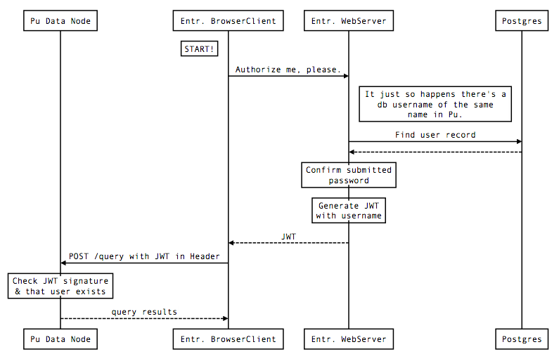
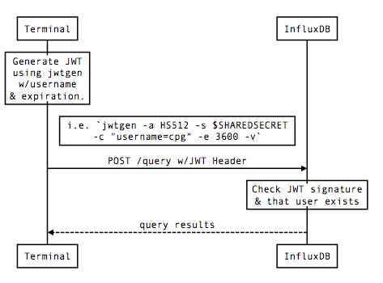
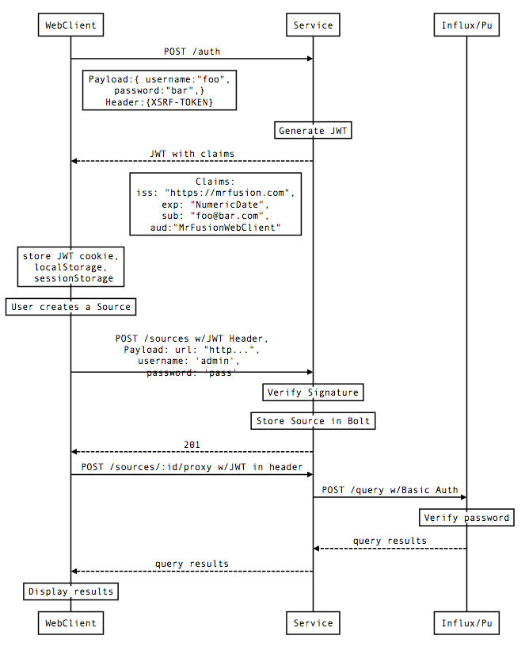

Originally Authored with Hackmd.io [Link](https://hackmd.io/CYBghgzATCCsCMBaAHGAZiRAWCsqIE4AjdRUZEYKCLMANmDCA===?both)

## Current Auth Flow 
### With Enterprise Web

Postgres is the source of truth for authorization credentials.
Plutonium only cares if the username is passed properly and signed.

_NOTE: JWT is never generated by the database. Influx OSS just checks that it is signed with the same secret._

### With OSS Flow

In this example, I have the shared secret in a file on my Terminal.

_NOTE: JWT is never generated by the database. Influx OSS just checks that it is signed with the same secret._

## Desired Auth Flow with Mr Fusion using Bolt.

This describes what we'd like to see.

_NOTE: Bolt might initially be replaced with a flat file. Obviously, we'd like to ship with Bolt. After that the plan is to be able to store in other system such as Influx, etcd, etc…_

## Notes:

* How do we keep the Data Source passwords safe?
    * Salt & Hash.
    * For v1 we'll use the same salting method as Pu
