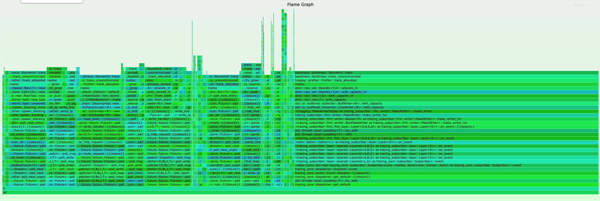
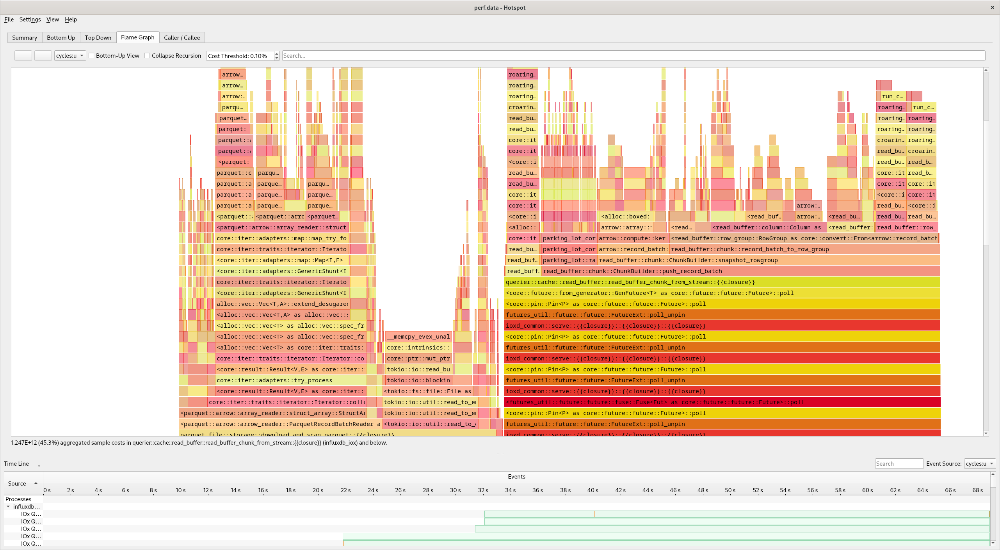
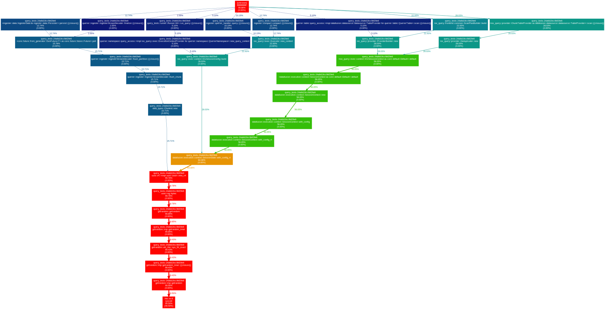
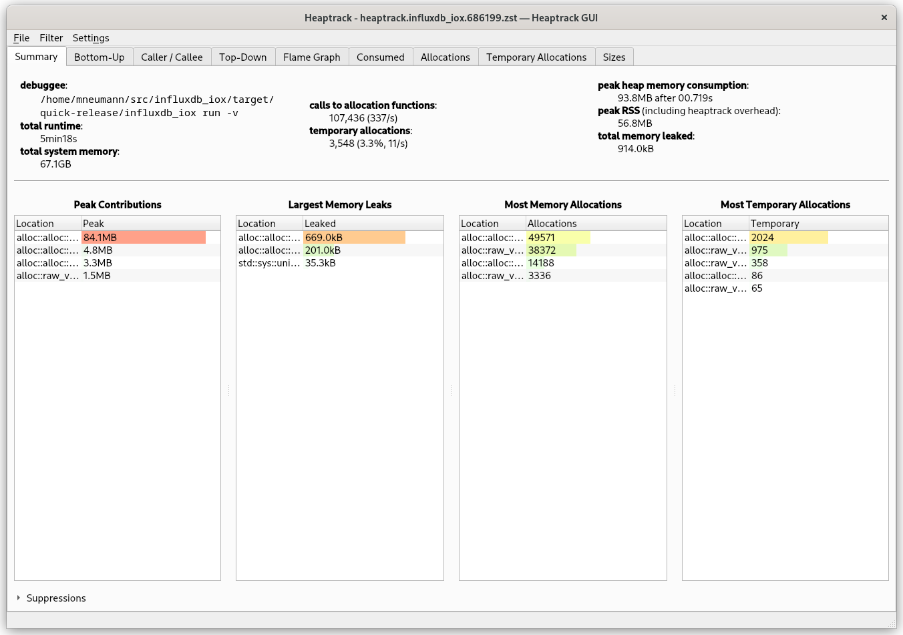
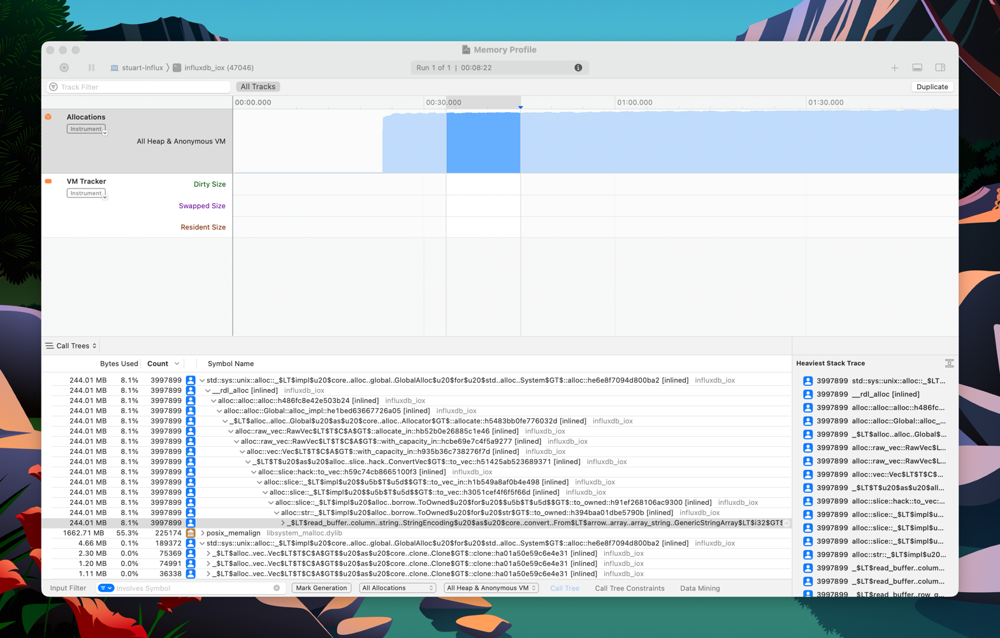
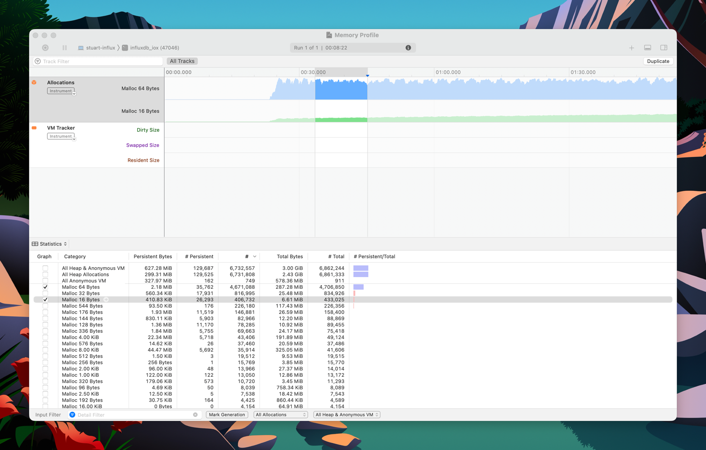

# IOx — Profiling

This document explains certain profiling strategies.

## Preparation
If you want to profile IOx, make sure to build+run it using an appropriate profile:

- **release:** This is a production quality binary. Use `cargo run --release` or `cargo build --release` (binary is
  `./target/release/influxdb_iox`).
- **quick-release:** This comes close to a production-like binary but the build step is not as heavy, allowing you to
  iterate faster -- especially after you have found an issue and want to try out improvements). Use
  `cargo run --profile quick-release` or `cargo build --profile quick-release` (binary is
  `./target/quick-release/influxdb_iox`).
- **debug:** This is an unoptimized debug binary. It can still be helpful though to figure out why tests (which use the
  same profile) take so long. Use `cargo run` / `cargo run --dev` or `cargo build` / `cargo build --dev` (binary is
  `./target/dev/influxdb_iox`).

Note that your concrete test hardware (esp. if is not an x64 CPU or a battery-driven laptop), your operating system
(esp. if it is not Linux) and other factors can play a role and may result to different result compared to prod.

If you want to trace memory allocations, you need to disable [jemalloc] by passing `--no-default-features` to cargo.


## Out-of-memory (OOM)
When profiling a process that may potentially use too much memory and affect your whole system by doing so, you may want
to limit its resources a bit.

### ulimit
Set a [ulimit] before running the process:

```console
$ # set ulimit to 1GB (value is in Kb)
$ ulimit -v 1048576
$ cargo run --release ...
```

The advantage of [ulimit] is that out-of-memory situations are clearly signaled to the process and you get backtraces
when running under a debugger.

### system OOM killer
Your system likely has an OOM killer configured. The issue with this is that it will use SIGKILL to terminate the
process, which you cannot investigate using a debugger (so no backtrace!).

The OOM killer is also used by all cgroup-based containers on Linux, e.g. [Docker], [Podman], [systemd-run].


## Embedded CPU Profiler
IOx includes an embedded `pprof` exporter compatible with the [go pprof] tool.

To use it, aim your favorite tool at your IOx host at the HTTP `/debug/pprof/profile` endpoint.

### Use the Go `pprof` tool:

Example

```shell
go tool pprof 'http://localhost:8080/debug/pprof/profile?seconds=5'
```

And you get output like:

```text
Fetching profile over HTTP from http://localhost:8080/debug/pprof/profile?seconds=5
Saved profile in /Users/mkm/pprof/pprof.cpu.006.pb.gz
Type: cpu
Entering interactive mode (type "help" for commands, "o" for options)
(pprof) top
Showing nodes accounting for 93, 100% of 93 total
Showing top 10 nodes out of 185
      flat  flat%   sum%        cum   cum%
        93   100%   100%         93   100%  backtrace::backtrace::libunwind::trace
         0     0%   100%          1  1.08%  <&str as nom::traits::InputTakeAtPosition>::split_at_position1_complete
         0     0%   100%          1  1.08%  <(FnA,FnB) as nom::sequence::Tuple<Input,(A,B),Error>>::parse
         0     0%   100%          1  1.08%  <(FnA,FnB,FnC) as nom::sequence::Tuple<Input,(A,B,C),Error>>::parse
         0     0%   100%          5  5.38%  <F as futures_core::future::TryFuture>::try_poll
         0     0%   100%          1  1.08%  <T as alloc::slice::hack::ConvertVec>::to_vec
         0     0%   100%          1  1.08%  <alloc::alloc::Global as core::alloc::Allocator>::allocate
         0     0%   100%          1  1.08%  <alloc::borrow::Cow<B> as core::clone::Clone>::clone
         0     0%   100%          3  3.23%  <alloc::vec::Vec<T,A> as alloc::vec::spec_extend::SpecExtend<T,I>>::spec_extend
         0     0%   100%          1  1.08%  <alloc::vec::Vec<T,A> as core::iter::traits::collect::Extend<T>>::extend
```

### Interactive visualizations

The `go tool pprof` command can also open an interactive visualization in a web browser page,
that allows you to render a call graph, or a flamegraph or other visualizations, and also search for symbols etc. See:

```shell
go tool pprof -http=localhost:6060 'http://localhost:8080/debug/pprof/profile?seconds=30'
```

### Use the built-in flame graph renderer

You may not always have the `go` toolchain on your machine.
IOx also knows how to render a flamegraph SVG directly if opened directly in the browser:

For example, if you aim your browser at an IOx server with a URL such as http://localhost:8080/debug/pprof/profile?seconds=5

You will see a beautiful flame graph such as


### Capture to a file and view afterwards

You can also capture to a file and then view with pprof afterwards

```console
$ # write data to profile.proto
$ curl 'http://localhost:8080/debug/pprof/profile?seconds=30' -o profile.proto

$ # view with pprof tool
$ go tool pprof -http=localhost:6060 profile.proto
```

### Pros & Cons
While the builtin CPU profiler is convenient and can easily be used on a deployed production binary, it may lack certain
flexibility and features. Also note that this is a sampling profiler, so you may miss certain events.


## Embedded Heap Profiler

IOx includes a memory heap profile tool as well as a CPU profiler. The memory usage tool is based on [heappy].

Support is is not compiled in by default, but must be enabled via the `heappy` feature:

```shell
# Compile and run IOx with heap profiling enabled
cargo run --no-default-features --features=heappy  -- run all-in-one
```

Now, you aim your browser at an IOx server with a URL such as http://localhost:8080/debug/pprof/allocs?seconds=5

You will see a green flamegraph such as




### Pros & Cons
[Heappy] is probably the easiest way to profile memory, but due to its simple nature its output is limited (e.g. it is
hard to track "wandering" allocations that are created in one and de-allocated in another place).


## cargo-flamegraph
You can use [cargo-flamegraph] which is an all-in-one solution to create flamegraphs for production binaries, tests, and
benchmarks.


## `perf` + X (Linux only)
While [cargo-flamegraph] is nice and simple, sometimes you need more control over the profiling or want to use a
different viewer. For that, install [cargo-with] and make sure you have [perf] installed. To profile a specific test,
e.g. `test_cases_delete_three_delete_three_chunks_sql` in `query_tests`:

```console
$ # cargo-with requires you to change the CWD first:
$ cd query_tests
$ cargo with 'perf record -F99 --call-graph dwarf -- {bin}' -- test -- test_cases_delete_three_delete_three_chunks_sql
```

Now you have a `perf.data` file that you can use with various tools.

### Speedscope
First prepare the `perf` output:

```console
$ perf script > perf.txt
```

Now to to [speedscope.app] and upload `perf.txt` to view the profile.

### Hotspot
[Hotspot] can analyze `perf.data` directly:




## Advanced `perf` (Linux only)
[perf] has loads of other tricks, e.g. syscall counting. So imagine after some profiling we figured out that our
test is using too many [`getrandom`] calls. Now we can can first use [perf] to generate a profile for that specific
syscall. Make sure you have [cargo-with] installed and run:

```console
$ # cargo-with requires you to change the CWD first:
$ cd query_tests
$ cargo with 'perf record -e syscalls:sys_enter_getrandom --call-graph dwarf -- {bin}' -- test -- test_cases_delete_three_delete_three_chunks_sql
```

and then we can generate a callgraph using [gprof2dot]:

```console
$ perf script | gprof2dot --format=perf | dot -Tsvg > perf.svg
```




## heaptrack (Linux only)
[heaptrack] is a quite fast and accurate way to profile heap allocations under Linux. It works with Rust applications
to. Install [heaptrack] and [cargo-with] and run:

```console
$ cargo with 'heaptrack' -- run --profile=quick-release --no-default-features -- run -v
```

Note the `--no-default-features` flag which will disable [jemalloc] so that [heaptrack] can inspect memory allocations.

After the program exists, the [heaptrack] GUI will spawn automatically:



### Pros & Cons
[heaptrack] is relatively fast, esp. compared to [Valgrind](#valgrind). It also works in cases when the process OOMs --
even when it get killed by `SIGKILL`.

Be aware that [heaptrack] does NOT work with tests (e.g. via
`cargo with 'heaptrack' -- test -p compactor -- my_test --nocapture`).[^heaptrack_tests] You have to isolate the code
into an ordinary binary, so create a file `my_crate/src/bin/foo.rs` and replace `#[tokio::test]` with `#[tokio::main]`.


## bpftrace (Linux only)
You may use even more advanced tools like [bpftrace] to trace about any aspect of the operating system. Install
[bpftrace] and [cargo-with], then create a tracing script in `program.txt`:

```text
tracepoint:syscalls:sys_exit_read /pid == cpid/ { @bytes = hist(args->ret); }
```

This example will produce a histogram of all sizes returned by the [`read`] syscall:

```console
$ cargo with "sudo bpftrace -c {bin} program.txt" -- run --profile=quick-release
    Finished quick-release [optimized + debuginfo] target(s) in 0.20s
Attaching 1 probe...
^C[influxdb_iox/src/main.rs:327]


@bytes:
[0]                    1 |@@@@@@@@@@@@@                                       |
[1]                    1 |@@@@@@@@@@@@@                                       |
[2, 4)                 0 |                                                    |
[4, 8)                 1 |@@@@@@@@@@@@@                                       |
[8, 16)                1 |@@@@@@@@@@@@@                                       |
[16, 32)               1 |@@@@@@@@@@@@@                                       |
[32, 64)               0 |                                                    |
[64, 128)              1 |@@@@@@@@@@@@@                                       |
[128, 256)             0 |                                                    |
[256, 512)             0 |                                                    |
[512, 1K)              4 |@@@@@@@@@@@@@@@@@@@@@@@@@@@@@@@@@@@@@@@@@@@@@@@@@@@@|
[1K, 2K)               2 |@@@@@@@@@@@@@@@@@@@@@@@@@@                          |
```

**WARNING: Due to the `sudo` hack, only use this for trusted programs!**


## Instruments: CPU / performance profiling (macOS Only)

Instruments may be used to profile binaries on macOS. There are several instruments available, but perhaps the most
useful for IOx development are the

* Sampling CPU profiler,
* Cycle-based CPU profiler,
* System Trace (system calls, CPU scheduling)
* File Activity (file system and disk I/O activity)


## Instruments: Allocations (macOS Only)

The allocations instrument is a powerful tool for tracking heap allocations on macOS and recording call stacks.





It can be used with Rust and `influxdb_iox`, but requires some additional steps on aarch64 and later versions of macOS
due to increased security.

### Preparing binary

Like heaptrack, you must compile `influxdb_iox` with `--no-default-features` to ensure the default system allocator is
used. Following the compilation step,
[you must codesign the binary](https://developer.apple.com/forums/thread/685964?answerId=683365022#683365022)
with the `get-task-allow` entitlement set to `true`. Without the codesign step, the Allocations instrument will fail to
start with an error similar to the following:

> Required Kernel Recording Resources Are in Use

First, generate a temporary entitlements plist file, named `tmp.entitlements`:

```sh
/usr/libexec/PlistBuddy -c "Add :com.apple.security.get-task-allow bool true" tmp.entitlements
```

Then codesign the file with the `tmp.entitlements` file:

```sh
codesign -s - --entitlements tmp.entitlements -f target/release/influxdb_iox
```

You can verify the file is correctly code-signed as follows:

```sh
codesign --display --entitlements - target/release/influxdb_iox
```
```
Executable=/Users/stuartcarnie/projects/rust/influxdb_iox/target/release/influxdb_iox
[Dict]
	[Key] com.apple.security.get-task-allow
	[Value]
		[Bool] true
```

or the running `influxdb_iox` process using its PID:

```sh
codesign --display --entitlements - +<PID>
```


## Tracing
See [Tracing: Running Jaeger / tracing locally](tracing.md#running-jaeger--tracing-locally).


## Valgrind
See [Valgrind](valgrind.md).


[bpftrace]: https://github.com/iovisor/bpftrace
[cargo-flamegraph]: https://github.com/flamegraph-rs/flamegraph
[cargo-with]: https://github.com/cbourjau/cargo-with
[Docker]: https://www.docker.com/
[`getrandom`]: https://www.man7.org/linux/man-pages/man2/getrandom.2.html
[go pprof]: https://golang.org/pkg/net/http/pprof/
[gprof2dot]: https://github.com/jrfonseca/gprof2dot
[heappy]: https://github.com/mkmik/heappy
[heaptrack]: https://github.com/KDE/heaptrack
[Hotspot]: https://github.com/KDAB/hotspot
[jemalloc]: https://jemalloc.net/
[perf]: https://perf.wiki.kernel.org/index.php/Main_Page
[Podman]: https://podman.io/
[`read`]: https://www.man7.org/linux/man-pages/man2/read.2.html
[speedscope.app]: https://www.speedscope.app/
[systemd-run]: https://www.freedesktop.org/software/systemd/man/systemd-run.html
[ulimit]: https://ss64.com/bash/ulimit.html


[^heaptrack_tests]: I have no idea why.
