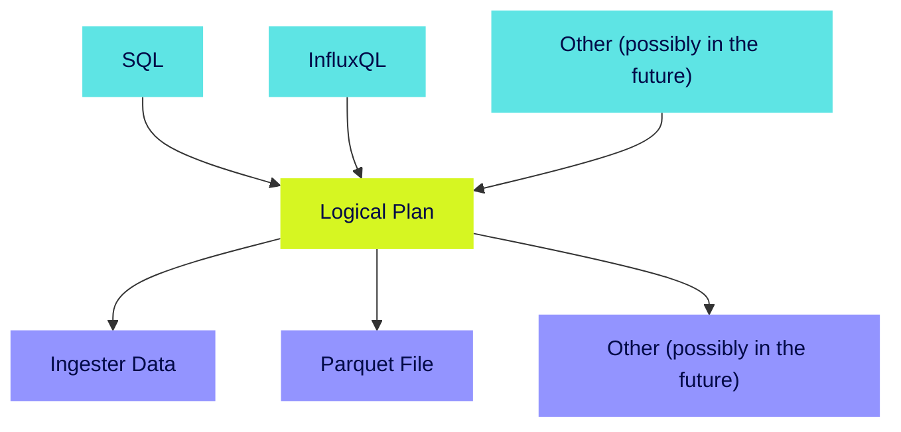
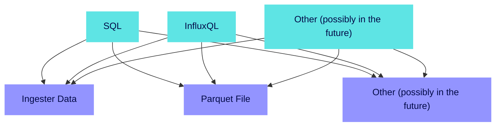
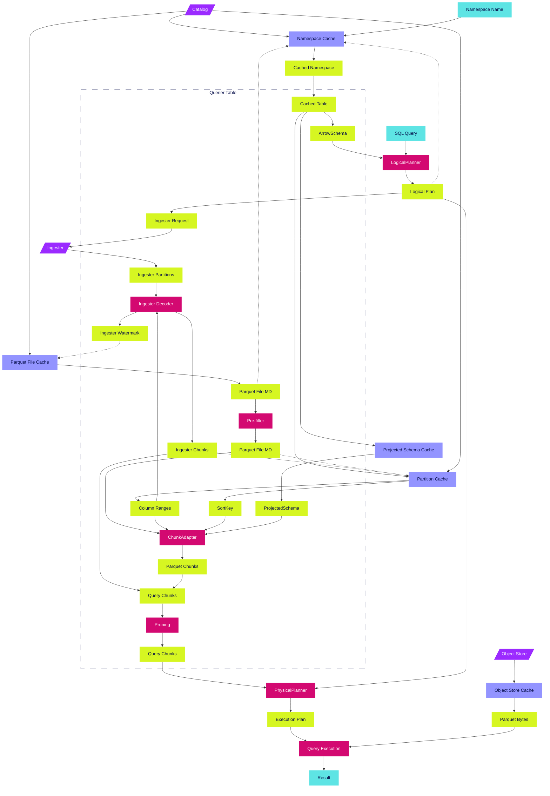
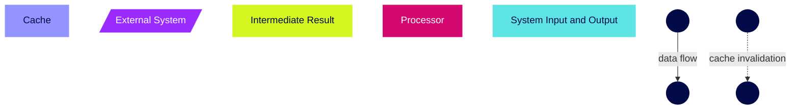

# InfluxDB IOx -- Query Processing

This document illustrates query processing for SQL and InfluxQL.

> **Note**
>
> There is another query interface called InfluxRPC (implemented in [`iox_query_influxrpc`]) which mostly reflects the old TSM storage API. The planning there works significantly different and this is NOT part of this document.

## Basic Flow
1. Query arrives from the user (e.g. SQL, InfluxQL)
2. The query engine creates a [`LogicalPlan`] by consulting the Catalog to find:
   - Tables referenced in the query, and their schema and column details
3. The query engine creates a [`ExecutionPlan`] by determining the Chunks that contain data:
   1. Contacts the ingester for any unpersisted data
   2. Consults the catalog for the name/location of parquet files
   3. Prunes (discards at this step) any parquet files
4. Starts the [`ExecutionPlan`] and streams the results back to the client

Some objects cached, especially the schema information, information about parquet file existence and parquet file
content.

A graphical representation may look like this:

## Code Organization
The IOx query layer is responsible for translating query requests from different query languages and planning and
executing them against chunks stored across various IOx storage systems.

Query Frontends:
- SQL
- InfluxQL
- Others (possibly in the future)

Sources of chunk data:
- Ingester Data
- Parquet Files
- Others (possibly in the future)

The goal is to use the shared query / plan representation in order to avoid N*M combinations of language and chunk
source. While each frontend has their own plan construction and each chunk may be lowered to a different
[`ExecutionPlan`], the frontends and the chunks sources should not interact directly. This is achieved by first creating
a [`LogicalPlan`] from the frontend without knowing the chunk sources and only during physical planning -- i.e. when the
[`ExecutionPlan`] is constructed -- the chunks are transformed into appropriate [`DataFusion`] nodes.

So we should end up with roughly this picture:

We are trying to avoid ending up with something like this:

## Frontend
We accept queries via an [Apache Arrow Flight] based native protocol (see [`service_grpc_flight::FlightService`]), or
via the standard [Apache Arrow Flight SQL].

Note that we stream data back to the client while [DataFusion] is still executing the query. This way we can emit rather
large results without large buffer usage.

Also see:

- ["Flight SQL"]

## Logical Planning
Logical planning transforms the query text into a [`LogicalPlan`].

The steps are the following:

1. Parse text representation is parsed into some intermediate representation
2. Lower intermediate representation into [`LogicalPlan`]
3. Apply logical optimizer passes to the [`LogicalPlan`]

### SQL
For SQL queries, we just use [`datafusion-sql`] to generate the [`LogicalPlan`] from the query text.

### InfluxQL
For InfluxQL queries, we use [`iox_query_influxql`] to generate the [`LogicalPlan`] from the query text.

### Logical Optimizer
We have a few logical optimizer passes that are specific to IOx. These can be split into two categories: *optimizing*
and *functional*.

The *optimizing* only change to plan to make it run faster. They do not implement any functionality. These passes are:

- [`influx_regex_to_datafusion_regex`]: Replaces InfluxDB-specific regex operator with [DataFusion] regex operator.

The *functional* passes implement features that are NOT offered by [DataFusion] by transforming the [`LogicalPlan`]
accordingly. These passes are:

- [`handle_gapfill`]: enables gap-filling semantics for SQL queries that contain calls to `DATE_BIN_GAPFILL()` and
      related functions like `LOCF()`.

The IOx-specific passes are executed AFTER the [DataFusion] builtin passes.

## Physical Planning
Physical planning transforms the [`LogicalPlan`] into a [`ExecutionPlan`].

These are the steps:

1. [DataFusion] lowers [`LogicalPlan`] to [`ExecutionPlan`]
   - While doing so it calls IOx code to transform table scans into concrete physical operators
2. Apply physical optimizer passes to the [`ExecutionPlan`]

For more details, see:

- ["IOx Physical Plan Construction"]
- ["Ingester ⇔ Querier Query Protocol"]
- ["Deduplication"]

## Data Flow
This is a detailled data flow from the querier point of view:

Legend:

## Caches
Each querier process has a set of in-memory caches. These are:

| Name | Pool | Backing System | Key | Value | Invalidation / TTL / Refreshes | Notes |
| ---- | ---- | -------------- | --- | ----- | ------------------------------ | ----- |
| Namespace | Metadata | Catalog | Namespace Name | `CachedNamespace` | refresh policy, TTL, invalidation by unknown table/columns | Unknown entries NOT cached (assumes upstream DDoS protection) |
| Object Store | Data | Object Store | Path | Raw object store bytes for the entire object | -- | |
| Parquet File | Metadata | Catalog | Table ID | Parquet files (all the data that the catalog has, i.e. the entire row) for all files that are NOT marked for deletion. | TTL, but no refresh yet (see #5718), can be invalided by ingester watermark. | |
| Partition | Metadata | Catalog | Partition ID | `CachedPartition` | Invalided if ingester data or any parquet files has columns that are NOT covered by the sort key. | Needs `CachedTable` for access |
| Projected Schema | Metadata | Querier | Table ID, Column IDs | `ProjectedSchema` | -- | Needs `CachedTable` for access |

Note that ALL caches have a LRU eviction policy bound to the specified pool.

### Cached Objects
The following objects are stored within the aforementioned caches.

#### `CachedNamespace`
- namespace ID
- retention policy
- map from `Arc`ed table name to `Arc`ed `CachedTable`

#### `CachedPartition`
- sort key
- column ranges (decoded from partition key using the partition template)

#### `CachedTable`
- table ID
- schema
- column ID => colum name map
- column name => column ID map (i.e. the reverse of the above)
- column IDs of primary key columns
- partition template

#### `ProjectedSchema`
Arrow schema projected from the table schema for a specific subset of columns (since some chunks do not contain all the
columns). Mostly done to optimize memory usage, i.e. some form of interning.

[Apache Arrow Flight]: https://arrow.apache.org/docs/format/Flight.html
[Apache Arrow Flight SQL]: https://arrow.apache.org/docs/format/FlightSql.html
[DataFusion]: https://arrow.apache.org/datafusion/
[`datafusion-sql`]: https://github.com/apache/arrow-datafusion/tree/main/datafusion/sql
["Deduplication"]: ./dedup_and_sort.md
[`ExecutionPlan`]: https://docs.rs/datafusion/26.0.0/datafusion/physical_plan/trait.ExecutionPlan.html
["Flight SQL"]: ./flightsql.md
[`handle_gapfill`]: https://github.com/influxdata/influxdb_iox/blob/main/iox_query/src/logical_optimizer/handle_gapfill.rs
[`influx_regex_to_datafusion_regex`]:
    https://github.com/influxdata/influxdb_iox/blob/main/iox_query/src/logical_optimizer/influx_regex_to_datafusion_regex.rs
["Ingester ⇔ Querier Query Protocol"]: ./ingester_querier_protocol.md
["IOx Physical Plan Construction"]: ./physical_plan_construction.md
[`iox_query_influxql`]: https://github.com/influxdata/influxdb_iox/tree/main/iox_query_influxql
[`iox_query_influxrpc`]: https://github.com/influxdata/influxdb_iox/tree/main/iox_query_influxrpc
[`LogicalPlan`]: https://docs.rs/datafusion-expr/26.0.0/datafusion_expr/logical_plan/enum.LogicalPlan.html
[`service_grpc_flight::FlightService`]: https://github.com/influxdata/influxdb_iox/blob/74a48a8f63c2b8602adf3a52fdd49ee009ebfa0b/service_grpc_flight/src/lib.rs#L246-L406
