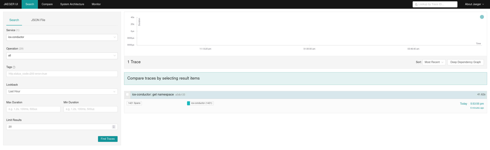
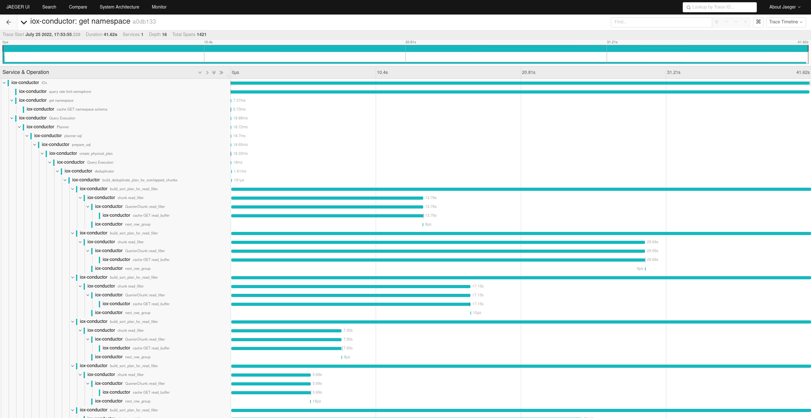

# Distributed Tracing in IOx

Not to be confused with the Rust [tracing](https://docs.rs/tracing) ecosystem, which we use for [logging](logging.md),
distributed tracing refers to ability to capture information about where time is spent during a given transaction,
potentially across service boundaries

## Components

### Trace (trace)

The `trace` crate contains the data model for distributed tracing and nothing else. It is an intentionally lightweight
dependency, as it is needed by any code that wishes to produce trace spans.

### Trace HTTP (trace_http)

The `trace_http` crate contains the logic to extract context information from HTTP requests, and use this to produce
Spans. This takes the form of a tower [layer] called `TraceLayer` that attaches the `SpanContext` of this generated
newly Span to the [Request] as an [extension]. This can then be accessed downstream and used to create new child spans.

```rust
async fn handle_request(req: Request<Body>) {
    // Get SpanContext if this request is sampled
    let maybe_span_ctx: Option<&SpanContext> = req.extensions().get();

    // Create a new span
    let maybe_span = maybe_span_ctx.map(|x| x.child("foo"));

    // Create a recorder that will record start and end times
    let recorder = SpanRecorder::new(maybe_span);
}
```

[layer]: https://docs.rs/tower/0.4.8/tower/trait.Layer.html

[Request]: https://docs.rs/http/0.2.5/http/request/struct.Request.html

[extension]: https://docs.rs/http/0.2.5/http/request/struct.Request.html#method.extensions

### Trace Exporters (trace_exporters)

The `trace_exporters` crate contains the logic to sink traces to upstream aggregators such as [Jaeger]. In the future,
we may also add [OTLP] in order to allow using [OpenTelemetry Collector] to fanout to different aggregators

[Jaeger]: https://www.jaegertracing.io

[OTLP]: https://github.com/open-telemetry/opentelemetry-specification/blob/main/specification/protocol/otlp.md

[OpenTelemetry Collector]: https://github.com/open-telemetry/opentelemetry-collector

## Running Jaeger / tracing locally

To use, develop, or debug the distributed tracing functionality locally you can do the following:

### Step 1: Run Jaeger locally

Follow instructions from https://www.jaegertracing.io/docs/1.26/getting-started/, which at the time of writing were
(simplified to what IOx needs):

```shell
docker run -d --name jaeger \
  -p 6831:6831/udp \
  -p 16686:16686 \
  jaegertracing/all-in-one:latest
```

### Step 2: Run IOx configured to send traces to the local Jaeger instance

Build IOx and run with the following environment variable set:

```text
TRACES_EXPORTER=jaeger
TRACES_EXPORTER_JAEGER_AGENT_HOST=localhost
TRACES_EXPORTER_JAEGER_AGENT_PORT=6831
```

For example, a command such as this should do the trick:

```shell
TRACES_EXPORTER=jaeger TRACES_EXPORTER_JAEGER_AGENT_HOST=localhost TRACES_EXPORTER_JAEGER_AGENT_PORT=6831 cargo run -- run all-in-one -v
```

Additional trace granularity, in particular traces with spans for each DataFusion partition, can be enabled with

```
INFLUXDB_IOX_PER_PARTITION_TRACING=1
```

_Some tracing setups may struggle with the size of the generated traces with this setting enabled._

### Step 3: Send a request with trace context

For IOx to emit traces, the request must have a span context set. You can use the `--header` flag on the IOx CLI to do
so. For example

```shell
$ # load data
$ curl -v "http://127.0.0.1:8080/api/v2/write?org=26f7e5a4b7be365b&bucket=917b97a92e883afc" --data-binary @tests/fixtures/lineproto/metrics.lp

$ # run a query and start a new trace
$ cargo run -- query 26f7e5a4b7be365b_917b97a92e883afc  'show tables' --gen-trace-id
```

### Step 4: Explore Spans in the UI

Navigate to the UI in your browser [localhost:16686/search](http://localhost:16686/search) and then chose the "iox-conductor" service from the
drop down:



You can then inspect the individual traces:


