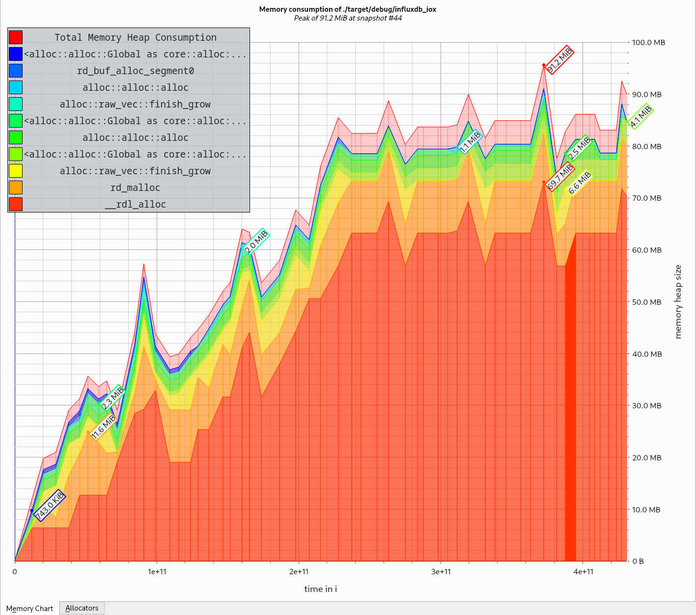

# Valgrind
This document explains how to use [Valgrind] to perform certain debug tasks.

**Be aware that [Valgrind] has certain limitations, e.g. that its virtual machine online runs on a single core and that
it only works well under Linux!**

## Build
Create a debug build that uses the system memory allocator (i.e. neither [heappy] nor [jemalloc]):

```console
$ cargo build --no-default-features
```

For longer runs you may wanna use a release build. Just note that some traces are less precise when working with them:

```console
$ cargo build --no-default-features --release
```

## Memory Leaks
There is a script that does most of the config setting. Just start the server with:

```console
$ ./scripts/valgrind_leak ./target/debug/influxdb_iox run ...
```

You can kill the server w/ `CTRL-C` when you're ready. The [Valgrind] output will be written to `valgrind-out.txt`.

## Suppression Rules
[Valgrind] allows you to suppress certain outputs. This can be used to ignore known "issues" like that [lazycell] leaks.
For IOx we provide a file that is used by the scripts (under `scripts/valgrind.supp`). If you plan to write your own
rules, here are some useful links:

- <https://valgrind.org/docs/manual/mc-manual.html#mc-manual.suppfiles>
- <https://www.valgrind.org/docs/manual/manual-core.html#manual-core.suppress>
- <https://wiki.wxwidgets.org/Valgrind_Suppression_File_Howto>

You may also use the `--gen-suppressions=all` to auto-generate supppression rules:

```console
$ ./scripts/valgrind_leak --gen-suppressions=all ./target/debug/influxdb_iox run ...
```

Note that Rust symbols like `influxdb_iox::main` are mangled in a way that [Valgrind] cannot parse them (e.g. to
`_ZN12influxdb_iox4main17h940b8bf02831a9d8E`). The easiest way is to replace `::` w/ `*` and prepand and append an
additional wildcard `*`, so `influxdb_iox::main` gets `*influxdb_iox*main*`.

## Massif
[Massif] allows you to track memory usage over time. This is helpful when memory is not really leaked in a traditional
sense (aka that allocated memory is not freed when the program exists) but when memory is accumulated in some data
structures. Run [Massif] via (assuming you have a release build):

```console
valgrind \
    --tool=massif \
    --detailed-freq=1 \
    --max-snapshots=100 \
    --threshold=0.1 \
    --time-unit=ms \
    ./target/release/influxdb_iox \
    run ...
```

You might wanna play around with the options a bit.

The simplest way to use the massif output is to use [massif-visualizer]:



[heappy]: https://github.com/mkmik/heappy
[jemalloc]: ttps://github.com/jemalloc/jemalloc
[lazycell]: https://crates.io/crates/lazycell
[Massif]: https://valgrind.org/docs/manual/ms-manual.html
[massif-visualizer]: https://github.com/KDE/massif-visualizer
[Valgrind]: https://valgrind.org/
